# LR6
## Лабораторная работа №6
### Выполнил: Оникий А.А. гр. 4417

**Ход работы**  

**5. Клонировал свой личный удалённый репозиторий на компьютер**
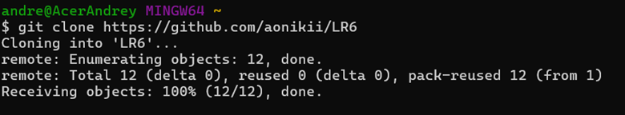

**6. Добавил файл через github, подтянул изменения в локальный репозиторий**
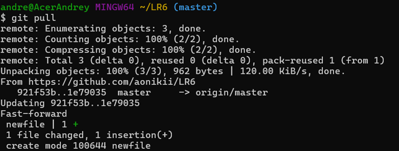

**7. Получил историю операций для каждой из веток**
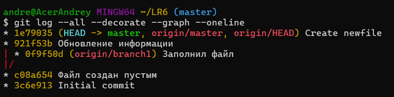

**8. Просмотрел послдение изменения**
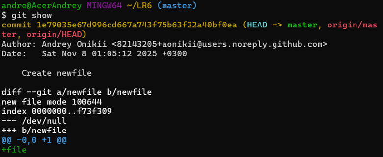

**9. Выполнил слияние в ветку master, разрешив конфликт**
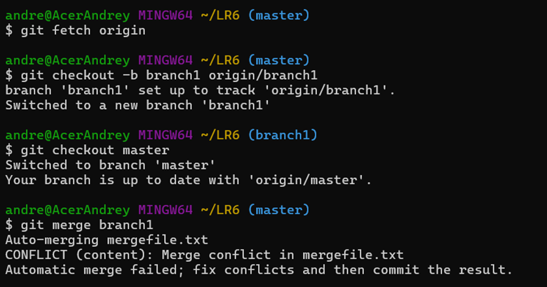

**10. Удалил побочную ветку**

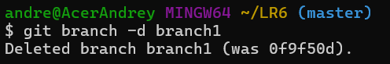

**11. Сделал изменения и зафиксировал их, оставляя комментарии, несколько раз**
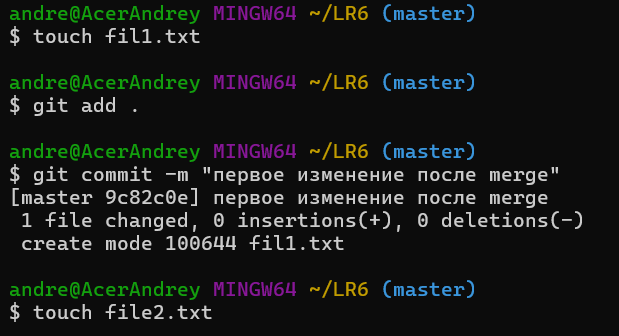
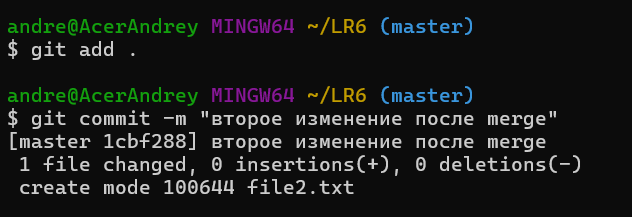

**12. Сделал откат коммита**

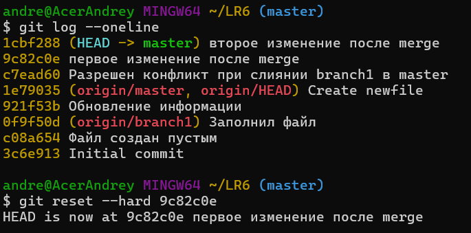

**13. Сделал ветку для отчета**

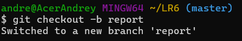

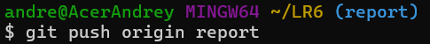

**15. Получил историю операций**

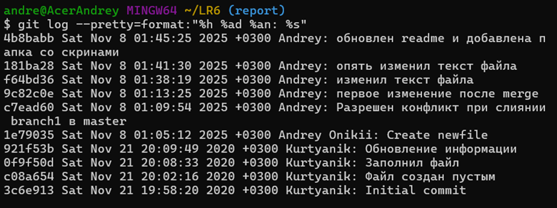

---

## Вывод
### Изучил базовые возможности системы управления версиями, получил опыт работы с Git Api, опыт работы с локальными и удаленными репозиториями.

